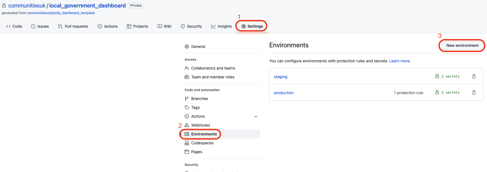

# Publication of a DLUHC owned dashboard.

## Table of contents
1. [Deploying to Gov UK PaaS](#deploying-to-gov-uk-paas)
2. [Setting up IP filtering](#setting-up-ip-filtering)
   1. [Creating the IP filtering application](#creating-the-ip-filtering-application)
   2. [Creating and binding the route service](#creating-and-binding-the-route-service)
3. [Creating an AWS S3 backing service](#creating-an-aws-s3-backing-service)
   1. [Creating credentials for the application to the bucket](#creating-credentials-for-the-application-to-the-bucket)
   2. [Creating credentials to allow for outside access to the bucket](#creating-credentials-to-allow-for-outside-access-to-the-bucket)
   3. [Refreshing the credentials, which allow for outside access to the bucket](#refreshing-the-credentials-which-allow-for-outside-access-to-the-bucket)
4. [Accessing a private S3 bucket in Python](#accessing-a-private-s3-bucket-in-python)
   1. [Connecting to s3](#connecting-to-s3)
   2. [Connecting to a bucket](#connecting-to-a-bucket)
   3. [Uploading a file to a bucket](#uploading-a-file-to-a-bucket)
   4. [Accessing a file within the bucket](#accessing-a-file-within-the-bucket)
   5. [Copying a file from one bucket to another bucket](#copying-a-file-from-one-bucket-to-another-bucket)
5. [Setting up GitHub manual reviewers for deployment](#setting-up-github-manual-reviewers-for-deployment)
6. [Setting up logging](#setting-up-logging)
   1. [What to log](#what-to-log)
7. [Setting up application alerts](#setting-up-application-alerts)
   1. [What if Sentry has downtime?](#what-if-sentry-has-downtime)
8. [Setting up autoscaling](#setting-up-autoscaling)
9. [Key terms](#key-terms)
10. [References](#references)

## Deploying to Gov UK PaaS

1. You will need an application you want to deploy, a Gov UK PaaS account and Cloud Foundry installed on your machine.
2. Navigate to your application.
3. Create a ```manifest.yml``` file, which will be used by Cloud Foundry when deploying your application. For example, for a python application:
```yml
---
applications:
  - name: <APP_NAME>
    memory: 2GB
    disk_quota: 3GB
    command: gunicorn run:server --env STAGE=production
    buildpacks:
      - python_buildpack
```
4. Log in to Gov UK PaaS through Cloud Foundry:
```bash
cf login -a api.london.cloud.service.gov.uk -u <USERNAME>
```
5. This will ask you for a password, enter your Gov UK PaaS password. 
6. If a space has not already been created, you will need to create a space using:
```bash
cf create-space <SPACE NAME> -o <ORGANISATION>
```
7. Once the space has been created, you will need to target that space using:
```bash
cf target -s <SPACE NAME>
```
8. Push the application using:
```bash
cf push <APP_NAME>
```

**Note:** When pushing without routes set in the ```manifest.yml``` Cloud Foundry will create and map a route using the application name. This can cause an error to be thrown if that route is already in use. Adding the ```--no-route``` flag will prevent this from happening. 

**Note:** Use the ```--strategy rolling``` command to minimise/eliminate downtime of the application.

9. If using the ```--no-route``` flag, you will need to create a route for your application using:
```bash
cf create-route <DOMAIN> --hostname <HOSTNAME>
```
10. Once you have created your route, the route will need to be mapped to your application using:
```bash
cf map-route <APP_NAME> <DOMAIN> --hostname <HOSTNAME>
```

---

## Setting up IP filtering

If you want to restrict access to certain IP's for secuity purposes, this can be done using IP filtering.

Due to how Gov UK PaaS works, it is not possible to enable IP filtering alongside basic authentication.
It's not possible to set up two routing services on the same hostname meaning only one or the other can be used.
It is possible however to implement these checks into your application code if required. We will not go through that here.

### Creating the IP filtering application

In order to provide IP filtering the following application can be downloaded from github:

```bash
git clone https://github.com/alphagov/paas-IP-authentication-route-service.git
```

Follow the read me for that application on how to add IP addresses you wish to allow access to.

### Creating and binding the route service

Follow the instructions in the readme on how to push the application up to Gov UK PaaS.

Once the application is on the PaaS, it will need to be set up as a route service using the following commands:

```bash
cf create-user-provided-service SERVICE_INSTANCE -r ROUTE_SERVICE_URL
cf bind-route-service DOMAIN SERVICE_INSTANCE --hostname HOSTNAME
```

**Note:** For this command the HOSTNAME is that of the application you want to lock down.

For applications with multiple routes, each hostname will need to be bound to in order to fully lock down the application.

---


## Creating an AWS S3 backing service

If your application uses files that you do not want within your source code, S3 buckets is an option to store files that can be securely accessed over the internet using secret access keys known only by the application.

The following are steps to take inorder to create a s3 bucket backing service within GovUK PaaS

Create a private bucket
```bash
cf create-service aws-s3-bucket default SERVICE_NAME
```

--- 
### Creating credentials for the application to the bucket
Once the service has been created you will need to create credentials for the application to the bucket. 
This is done by binding the service to the application.

Bind the bucket to the application

Create a json file containing:
```json
{"permissions": "PERMISSION"}
```

```bash
cf bind-service APP_NAME SERVICE_NAME -c <json.file>
```

Permissions can be `read-write` or `read-only`. The dashboard should only have readonly permissions.

**Note:** If using a MAC, this can be done using inline json:
```bash
cf bind-service APP_NAME SERVICE_NAME -c `{"permissions": "PERMISSION"}`
```

These credentials can be found by running ```cf env APP_NAME``` after binding.

These will be under VCAP_SERVICES

```bash
VCAP_SERVICES: {
  "aws-s3-bucket": [
    {
      "binding_guid": "GUID",
      "binding_name": null,
      "credentials": {
        "aws_access_key_id": "ACCESS_KEY_ID",
        "aws_region": "eu-west-2",
        "aws_secret_access_key": "SECRET_ACCESS_KEY",
        "bucket_name": "paas-s3-broker-prod-lon-XXXX",
        "deploy_env": ""
      },
      "instance_guid": "GUID",
      "instance_name": "SERVICE_NAME",
      "label": "aws-s3-bucket",
      "name": "SERVICE_NAME",
      "plan": "default",
      "provider": null,
      "syslog_drain_url": null,
      "tags": [
        "s3"
      ],
      "volume_mounts": []
    }
  ]
}
```

**NOTE**

Having the environment variables set in this way will not work when using boto3. 
See [Accessing a private S3 bucket in python](#accessing-a-private-s3-bucket-in-python) 

---

### Creating credentials to allow for outside access to the bucket

Create a json file, containing:
```json 
{"allow_external_access": true}
```

```bash
cf create-service-key SERVICE_NAME SERVICE_KEY -c <file.json>
```

**Note:** If using a MAC, this can be done using inline json:
```bash
cf create-service-key SERVICE_NAME SERVICE_KEY -c '{"allow_external_access": true}'
```

Credentials for the created key can be accessed by the following command:

```bash
cf service-key SERVICE_NAME SERVICE_KEY
```

---

### Refreshing the credentials, which allow for outside access to the bucket

A service key and credentials allow external access to the bucket, these details need to be kept secure to prevent unauthorised access to the bucket. The service key and credentials can be refreshed, to maintain security of the bucket.

1. List all service keys for the service using 
```bash 
cf service-keys SERVICE_NAME
```
2. Delete the required credentials using
```bash
cf delete-service-key SERVICE_INSTANCE SERVICE_KEY
```
3. Follow [Creating credentials to allow for outside access to the bucket](#creating-credentials-to-allow-for-outside-access-to-the-bucket)
**Note:** If these credentials are used as environemnt secrets on GitHub, they will need updating with the new credentials.

---

## Accessing a private S3 bucket in Python

### Connecting to S3
In order to connect to S3, you will need an AWS access key and an AWS secret access key.

#### To get credentials for a service key use:
```bash
cf service-key SERVICE-NAME SERVICE-KEY
```
The output will look like:
```bash
{
   "aws_access_key_id": "ACCESS_KEY_ID",
   "aws_region": "eu-west-2",
   "aws_secret_access_key": "SECRET_ACCESS_KEY",
   "bucket_name": "paas-s3-broker-prod-lon-XXXX",
   "deploy_env": ""
}
```

---

Within python, we need to use the boto3 package to connect to the s3 backing service.

We use boto3 to create a resource object, which represent an object-oriented interface to Amazon Web Services (AWS).

```python
import boto3

s3_client=boto3.resource(
  's3',
  aws_access_key_id='ACCESS_KEY_ID',
  aws_secret_access_key='SECRET_ACCESS_KEY', 
  region_name='eu-west-2'
)
```

It is also possible to connect to an S3 bucket without providing the credentials in the python code.
The boto3 package will first look in the environment variables for credentials if not provided. E.g.:

```python
import boto3

s3_client = boto3.resource('s3')
```

Using environment variables for credentials requires the following environment variables to set on the server. 
See [Setting environment variables using cloudfoundry](#setting-environment-variables-using-cloudfoundry).

```
AWS_ACCESS_KEY_ID
AWS_SECRET_ACCESS_KEY
AWS_REGION
```

---

#### Setting environment variables using cloudfoundry

```bash
cf set-env APP_NAME ENVIRONMENT_VARIABLE VALUE
```

### Connecting to a bucket

Using the resource object, we can connect to a given bucket using the following:

```python
bucket=s3_client.Bucket(name='paas-s3-broker-prod-lon-XXXX')
```

---

### Uploading a file to a bucket

Once connected to a bucket, we can then manage files within it.

```python
bucket.upload_file(key='mykey.txt', filename='mykey.txt')
```

---

### Accessing a file within the bucket

As we are no longer wanting to store CSV's within the repo, we need to make a request to our s3 backing service to get out data.
Pandas ```read_csv(...)``` is able to read directly from a file-like object such as our expected response from S3, which we get using ```s3.Object(...).get()['Body]```.

```python
response_content = s3.Object('paas-s3-broker-prod-lon-XXXX', "mykey.txt").get()['Body']

df = pd.read_csv(response_content)
```

If you have different buckets for different environments the bucket name should be set as an environment variable that can be retrieved through the code.
See [Setting environment variables using cloudfoundry](#setting-environment-variables-using-cloudfoundry).

#### Accessing the environment variable within Python:

```python
import os
bucket_name = os.environ("bucket_name").get()
response_content = s3.Object(bucket_name, "mykey.txt").get()['Body']
```

---

### Copying a file from one bucket to another bucket
In order to move files across buckets in different s3 instances, connection will need to be made to each bucket.

```python
  def connect_to_bucket(key_id, access_key, bucket_name):
    s3_client = boto3.resource(
        "s3",
        aws_access_key_id=key_id,
        aws_secret_access_key=access_key,
        region_name="eu-west-2",
    )
    return s3_client.Bucket(name=bucket_name)
```

Once connected to both buckets (staging_bucket and production_bucket), we can then manage files within each bucket. For example, to copy files from staging_bucket to production_bucket:

```python
file="data.csv"
# Access files within staging_bucket
response_content = staging_bucket.Object(file).get()["Body"]
# Upload files to production_bucket
production_bucket.upload_fileobj(response_content, file)
```

**Note:** We use the ```.Object(...).get()``` function rather than the ```download_fileobj(...)```, so that we can store the file in a variable, instead of saving it locally.

---

## Setting up GitHub manual reviewers for deployment
A manual review process is ideal to have for a production environment as it prevents code that is yet to be manually tested reaching the public.
This instead allows for time to be taken between a staging deployment, to make sure everything is working as expected.

1. From the GitHub repository click ```Settings```, then ```New environment```, provide a name for the environment and click ```Configure environment```.

2. Tick ```Required reviewers``` and enter usernames/team-name, then click ```Save protection rules```. GitHub Actions will then require someone from that group to approve the job with the environment set, before it can run.
3. Reference the new environment within the GitHub Actions workflow file at the job level e.g.:
```
jobs:
  deploy-production:
    name: 'Deploy to production Gov PaaS'
    runs-on: ubuntu-20.04
    environment: '<environment_name>'
    concurrency: production_environment
    needs: [deploy-staging]
```
4. From the GitHub repository click ```Settings```, then ```Environments```, click on the environment to configure and click ```Add secret```.
5. Secrets can be used within GitHub Actions using: ```${{secrets.<secret_name>}}```
   1. Secrets at the environment level will take precedence over repository level secrets. 

### Setting up manual reviewers from different groups

If your application requires approval from two groups e.g. Approval from a product manager and an approval from the development team,
follow these instructions:

1. Create separate environments for each of the groups you require approval from. See [Setting up GitHub manual reviewers for deployment](#setting-up-github-manual-reviewers-for-deployment).
2. Add the required reviewers as appropriate. e.g. Developers in the developer environment and product managers in product manager environment.
3. Within the GitHub action, create a job for each of the environments e.g.:
```yml
jobs:
   tech_approval:
    name: 'Tech approval'
    environment: 'prod-tech'
    runs-on: ubuntu-20.04
    steps:
      - name: 'Tech approved'
        run: echo 'Technical approved'
   
   product_approval:
    name: 'Product manager approval'
    environment: 'prod-product'
    runs-on: ubuntu-20.04
    steps:
      - name: 'Product manager approved'
        run: echo 'Product manager approved'
```
4. For the job that you require manual approval on, add the ```needs: [tech_approval, product_approval]``` to that job. e.g.:
```yml
jobs:
  deploy-production:
    name: 'Deploy to production Gov PaaS'
    runs-on: ubuntu-20.04
    needs: [product_approval, tech_approval]
```

## Setting up logging
Logging allows us to keep records of logs from our application that would otherwise be difficult to access. This is so that we can be informed as to possible error's being thrown, allowing for easier debugging of these issues. Gov UK PaaS has documentation on how to use Logit, so we will be using Logit in this example. As standard Gov UK PaaS uses [Loggregator](https://docs.cloudfoundry.org/loggregator/architecture.html), which deals with logs regarding network traffic and more.

1. Create an account on [Logit](https://logit.io/)
2. Follow the "Set up the Logit log management service" [guidance](https://docs.cloud.service.gov.uk/monitoring_apps.html#set-up-the-logit-log-management-service) on Gov UK PaaS.
3. To create logs from your application, these will need to be created using the in-built python logging package. For example:
```python
import logging
logging.info("test message")
```
By default logging is done at warning level, meaning info messages will not be logged. To enable info messages to be logged, the logging package has to be configured:
```python
logger = logging.getLogger("root")
logger.setLevel(logging.INFO)
logging.basicConfig()
```
More information on logging levels can be found [here](https://docs.python.org/3/library/logging.html#logging-levels)
For Made Tech's approach to logging see [here](https://github.com/madetech/productionisation/blob/master/PRODUCTIONISATION.md#6-application-logging)

### What to log
At a minimum you should log all caught exceptions. More information on what is appropriate to log for your application can be found [here.](https://cheatsheetseries.owasp.org/cheatsheets/Logging_Cheat_Sheet.html) <br>
**Do not log sensitive information such as a user's personal information or environment secrets.**

## Setting up application alerts
Application alerts allow us to be alerted to issues with our application, so issues can be responded to promptly and user experience is maintained. We will be using Sentry in this example.

1. Create an account on [Sentry](https://sentry.io/)
2. Follow the "Quick start guidance" on Sentry after you have created an account, to: Capture your first error, Invite your team, Track releases, Get smarter alerts <br>

More information on setting up alerts within Sentry can be found [here](https://docs.sentry.io/product/alerts/)

### What if Sentry has downtime?

Due to some recent downtime in Sentry, we have investigated what happens to our application if this were to occur. There is no significant effect to our application - no errors are thrown, warnings are logged regarding being unable to establish a connection.

## Setting up autoscaling
Autoscaling is a way of adjusting the number of instances of an application depending on the amount of traffic to that application. It helps prevent the application slowing down in times of high traffic, maintaining a positive user experience. Gov UK PaaS provides guidance on setting up autoscaling for an application.

1. Follow the Gov UK PaaS [guidance](https://docs.cloud.service.gov.uk/managing_apps.html#autoscaling) to set up autoscaling for your application.

---

### Key terms
SERVICE_NAME = Unique identifier for the bucket.

SPACE_NAME = A unique identifier for a space.

APP_NAME = The application set up within GovUK PaaS.

ORGANISATION = A unique identifier for your organisation within Gov UK PaaS.

SERVICE_KEY = Unique identifier for external access credentials.

SERVICE_INSTANCE = A unique identifier for a service.

ROUTE_SERVICE_URL = The url of the route service endpoint. An example of this is ```https://my-basic-auth-service-app.london.cloudapps.digital```

HOSTNAME = The host or app name assigned to an app.

DOMAIN = The location of a website. A list of available domains can be found using the following command:
`cf domains`

---

## References
https://docs.cloud.service.gov.uk/deploying_services/s3/#bind-an-aws-s3-bucket-to-your-app

https://boto3.amazonaws.com/v1/documentation/api/latest/guide/quickstart.html

https://cloudlumberjack.com/posts/github-actions-approvals/ 
