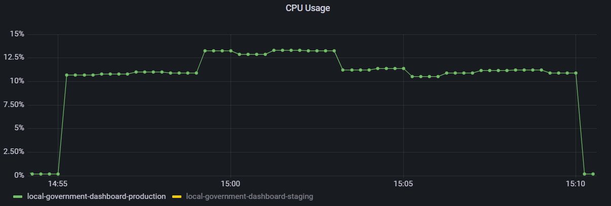
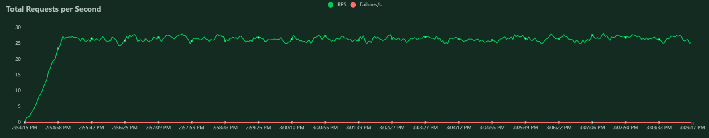
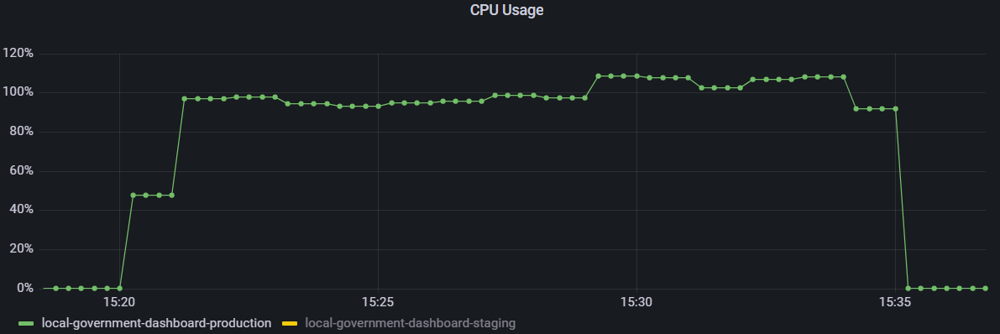
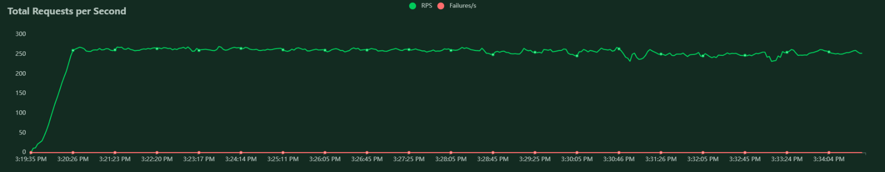

# Assumptions

We have used a chrome plug-in, SimilarWeb to investigate other sites which could have a similar audience as our dashboards - LG Inform and LGC plus. These sites seem to average in the range of 50k users a month.

The load test will initally focus on user routes through the dashboard, instead of simply requesting each page indidually then moving onto the next test. The benefit of this approach is we can mimic a user making choices in the available dropdowns on each of the pages.

The first iteration of load testing will not use a web framework such as Cypress or Selenium WebDriver to control changes to the dropdowns on each of the pages. Instead the locust tests will issue new page requests with query strings values matching the desired options in the dropdowns. This will slightly skew the results as instead of an asynchronous XHR request being executed within the page, we are requesting a new page load that will have a larger page size.

The metrics for these load tests will be gathered using the Prometheus platform logging for CPU usage and the Locust user interface will provide response times and failed user requests.

We will break our estimate down into 2 scenarios - General usage and Launch day (expecting a higher usage on launch) and run each scenario load test for 15 minutes.

## General usage estimate: 
500000 monthly users / 30 days average in a month = 1667 daily users  
Assuming users are active for 12 hours a day, taking into consideration lower usage during the evening and night: 1667 daily users / 12 = 139 users per active hour  
Breaking that down into a 20 minute window equates to around 46 users.

## Launch day estimate:
We estimate the number of users on launch day to be 10 times that of our general usage estimate, equating to 460 users.

# Findings
## General usage
We ran a load test where we spawned 1 user per second up to a maximum of 46 users, we ran this test for 15 minutes.
We repeated this test 3 times and the results were always within the same bounds. 

  
CPU usage peaked at just under 13% across the duration of the load test.

_1651672444.png)  
The median response times stayed consistent at 30ms per request. The 95 percentile was initially high, however it quickly dropped to the range of 40ms - 60ms for the duration of the load test.

  
There were roughly 28 requests per second, of which none failed.

## Launch day
We ran a load test where we spawned 10 users per second up to a maximum of 460 users, we ran this test for 15 minutes.
We repeated this test 3 times and the results were always within the same bounds. 

  
CPU usage was consistently around 96% for most of the load test, however at some points it exceeded 100% and reached 110%.

_1651673914.png)  
The 95 percentile response time averaged at 400ms, however the average median time was around 80ms. There was more fluctuation for the response time with the higher number of users, which is to be expected.

  
There were roughly 200 requests per second, of which none failed.

# Conclusion
Based on our estimated usage of the dashboard, we expect it to be able to handle loads of up to 460 users at one time. However, at higher usage we can expect poorer performance, though this should not be longer than 1 second, which we believe to be within a reasonable range. 

Due to the extremely high CPU usage in the launch day scenario it is recommended that we implement auto-scaling within Gov PaaS for this application to prevent the possibility of the dashboard falling over.

