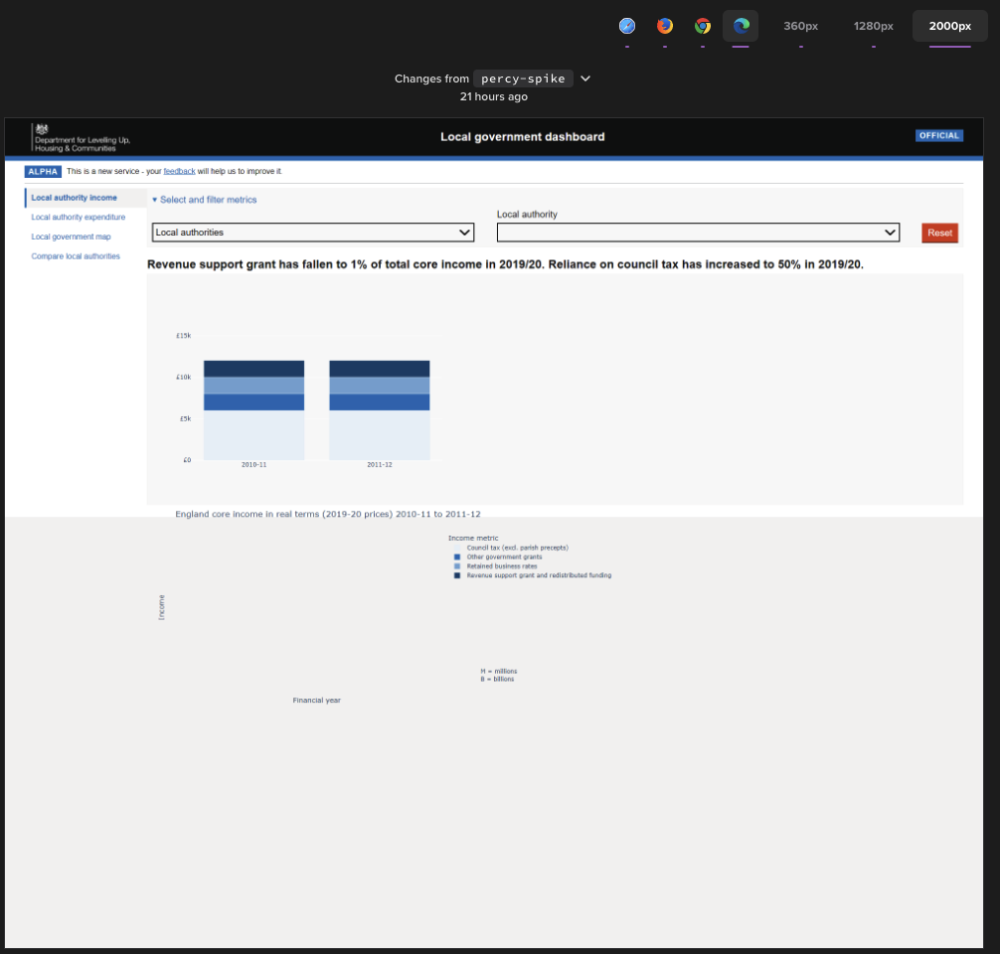

# Assumptions

We have investigated whether [Percy](https://percy.io/), a snapshot testing tool, works with our local government dashboard. 

Snapshot testing tools ensure data changes are not introducing any regressions, so we can catch regression errors in our dashboard before users see them. Our dashboard mostly displays data in graphs/charts, which are produced in Plotly using SVG’s. Snapshot testing tools take snapshots of the screen, before and after a change, allowing us to identify and resolve any regressions. 

An income dashboard test was created with enough data to generate a bar chart on the page. A Percy visual test was added to the income dashboard page.

# Findings

We performed a Percy visual test on the income dashboard test page. We compared a baseline screenshot to a screenshot taken after data changes, the data changes were highlighted in red. However, the screenshots produced by Percy did not display the x-axis, y-axis and title labels where expected.

We then performed a Percy visual test on an alternative Plotly graph page, created externally to the team. Again, the x-axis, y-axis and title labels were not displayed as expected.

# Conclusion

Based on our attempts to use Percy as a snapshot testing tool with Plotly dashboards, we do not recommend the use of Percy. 

# Further research 

I'd say focus that quick look on the other options as to which (if either) to create a second spike ticket for.
