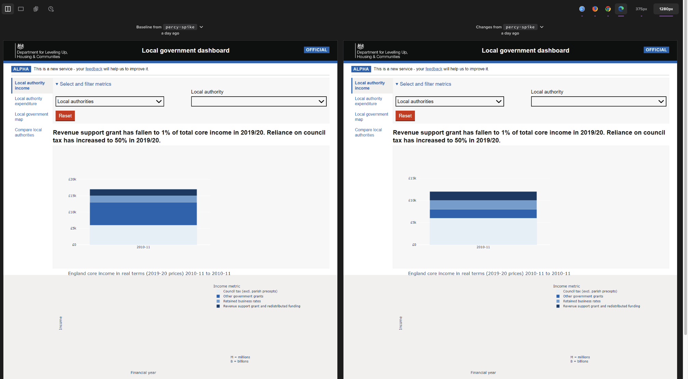
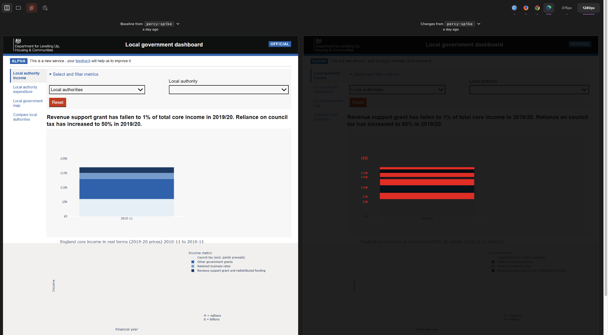

# Context

We have investigated whether [Percy](https://percy.io/), an automated visual testing tool, works with our local government dashboard. The dash testing package provides this functionality through the use of dash-duo.

```python
from index import app

def test(dash_duo):
    dash_duo.start_server(app, 8085)
    # ... load the page to take a snapshot of
    dash_duo.percy_snapshot("test_snapshot_01")
```

Visual testing tools ensure the presentation of the page is consistent when updates are being made. A baseline image can be set, which can be used to compare future images to - any changes are then highlighted in red within the Percy user interface. These changes can then be reviewed, and if deemed appropriate a new baseline image can be set for future screenshots to be compared against. Otherwise, the difference is a highlighted regression, which can be addressed quicker. Our dashboard mostly displays data in graphs/charts, which are produced in Plotly using SVG’s.

A test was performed on the income dashboard page, which included taking Percy snapshots to investigate how we use this tool.

# Findings

We performed a Percy visual test on the income dashboard page. We first created a baseline image ****** We compared a baseline screenshot to a screenshot taken after data changes, the data changes were highlighted in red. However, the screenshots produced by Percy did not display the x-axis, y-axis and title labels where expected.

We then performed a Percy visual test on an alternative Plotly graph page, created externally to the team. Again, the x-axis, y-axis and title labels were not displayed as expected.



# Conclusion

Based on our attempts to use Percy as a visual testing tool with Plotly dashboards, we do not recommend the use of Percy. 

# Further research 

I'd say focus that quick look on the other options as to which (if either) to create a second spike ticket for.
